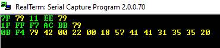
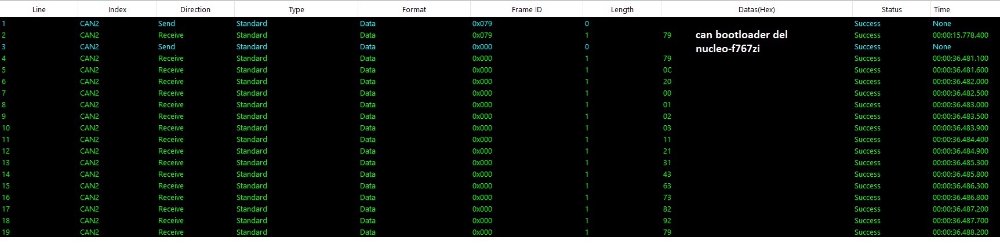

# stm32BootloaderLearning
Dump repo for all links and notes about my bootloader learning curve

# how to talk with the bootloader     
https://www.youtube.com/watch?v=GR8Vy5QvDHU  
Not all chips use all available peripherals with the bootloader, for example stm32f072 has canbus capabilities  
but its stm32 native bootloader doesnt support it.  
On the other hand STM32F446RETx has canbus capabilities and its native bootloader does support CAN2.  

# booting process  

https://www.youtube.com/watch?v=3brOzLJmeek&ab_channel=EmbeddedSystemswithARMCortex-MMicrocontrollersinAssemblyLanguageandC
  

# sources of reset  
http://www.micromouseonline.com/2012/03/29/stm32-reset-source/  
In the RCC_CSR register, the bits to look for are:

    Bit31: LPWRRSTF – Low-power reset flag  
    Set by hardware when a Low-power management reset occurs.  
    Bit30: WWDGRSTF – Window watchdog reset flag  
    Set by hardware when a window watchdog reset occurs.  
    Bit29: IWDGRSTF – Independent watchdog reset flag  
    Set by hardware when an independent watchdog reset from VDD domain occurs.  
    Bit28: SFTRSTF – Software reset flag  
    Set by hardware when a software reset occurs.  
    Bit27: PORRSTF – POR/PDR reset flag  
    Set by hardware when a POR/PDR reset occurs.  
    Bit26: PINRSTF – PIN reset flag  
    Set by hardware when a reset from the NRST pin occurs.  
    Bit25: BORRSTF – BOR reset flag  
    Set by hardware when a POR/PDR or BOR reset occurs.   

# UART BOOTLOADER UUID  

uart bootloader polling of the UUID  
http://blog.gorski.pm/stm32-unique-id  
  
# canbus bootloader
 
  