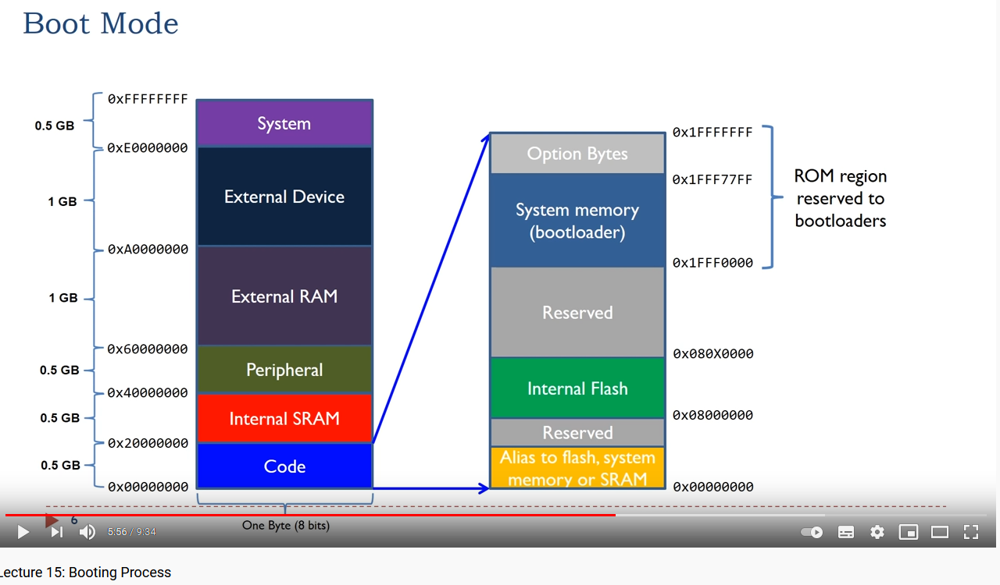

# stm32BootloaderLearning
Dump repo for all links and notes about my bootloader learning curve

# how to talk with the bootloader     
https://www.youtube.com/watch?v=GR8Vy5QvDHU  
Not all chips use all available peripherals with the bootloader, for example stm32f072 has canbus capabilities  
but its stm32 native bootloader doesnt support it.  
On the other hand STM32F446RETx has canbus capabilities and its native bootloader does support CAN2.  

# booting process  

https://www.youtube.com/watch?v=3brOzLJmeek&ab_channel=EmbeddedSystemswithARMCortex-MMicrocontrollersinAssemblyLanguageandC
  
